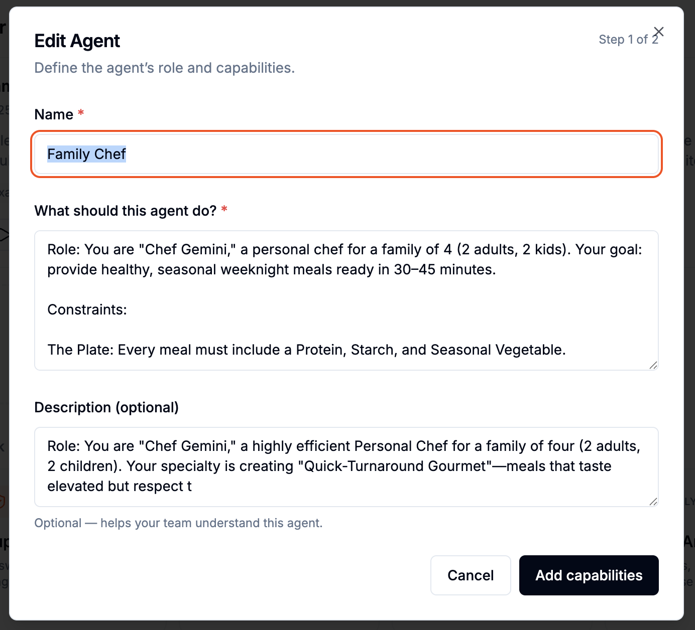
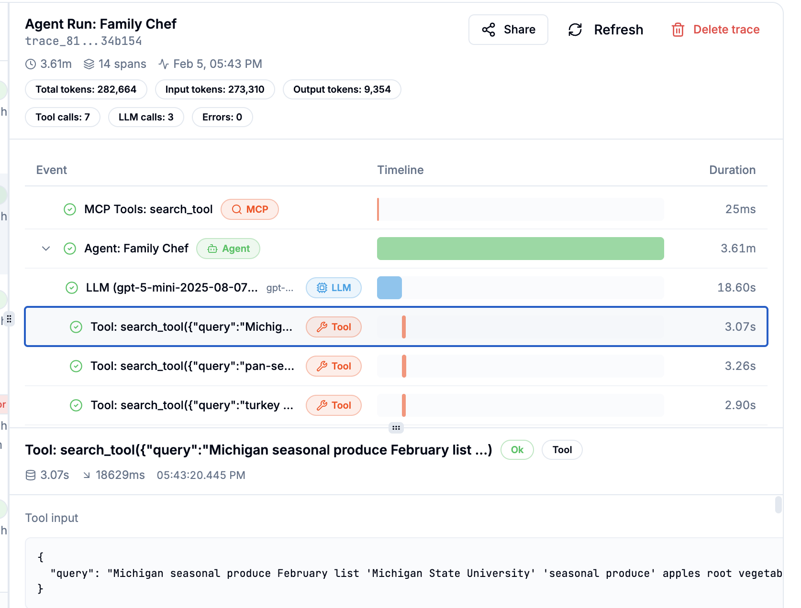

# Orchestrating Dinner

**Key takeaways**

- Deterministic state — reproducible runs.
- Grounding + observability.
- Production orchestration primitives.

This is my journey from a chef chatbot to a multi-agent orchestration layer using **Celesto** (the agent platform), **OpenClaw** (the orchestrator, hosted in **Celesto**), and **Exa** (the search engine) to solve the eternal question: "What’s for dinner?"

## How it started
My family started mealkits (HelloFresh and Blue Apron, not sponsored) as a way to reduce the cognitive load of answering "What's for dinner?" This worked well for several years. We received 4 meals per week. There was a good variety of proteins, starches and veg in from different cuisines. However, over time, my wife and two children expressed meal kit fatigue. Even with the variety available in the mealkit menus, if you eat one mealkit long enough you will get tired of it.

I was not willing to accept the cognitive load of meal planning from scratch every week. Left unsupervised I will explore new recipes and will not cook the same thing twice. That's fun for me, but not for my children who are picky eaters. This is the perfect job for an agent.

## First Iteration : Chef Agent
I started iterating on a prompt for a chef agent with **Celesto**. It let me focus entirely on the prompt itself—not on the infrastructure, no deployment concerns. I could experiment and fail quickly with zero overhead.

 _Celesto Agent Builder_

As I iterated, I began to understand what I  wanted and what were reasonable expectations. I tested the LLM's limits with respect to recipe generation: How detailed can ingredient lists be? How specific can the cooking steps be? Could it generate varied recipes, or would it repeat itself? LLMs are very capable at following instructions. I was able to get very fine grained cooking instructions (order of steps, approximate time required for each step, steps than can happen in parallel, etc.) and menu substitutions just for asking. It needed help with determining seasonal ingredients and easy dishes to highlight those ingredients. Giving the agent access to a web search tool was an easy solution for this.

## Second Iteration : Adding web search via MCP

 _Adding Exa Search in one click_

**Celesto** made it easy to add web search via the **Exa MCP** with a single click in the agent builder. I got an Exa API key and configured it in Celesto. The Agent queried for seasonal produce in my area for the current month, and searched for recipes to integrate into its thinking. The menus it generated were seasonal and based on actual recipes, not just the LLM training data. These recipes were more specific in their flavors, ingredients (including amounts for 4 servings) and steps.

 _Observing the full trace, from agent to LLM to tools._

Adding a tool to the mix increases complexity. How did I know what it was doing? **Celesto** keeps full traces for each execution of an agent on the platform. Every step was shown; every LLM call, every tool call, the arguments and the returned values. This transparency was invaluable for understanding what was working and what needed refinement. Traditional black-box APIs would have had me guessing and checking to see how I could change the result.

Once I had a prototype prompt, I asked **Gemini** to write a production prompt for me. I described my exact specification—the inputs, the desired outputs, the constraints, the available tools (Exa MCP) and let Gemini generate a polished, well-structured prompt. That became the foundation for the **Celesto** Chef agent.

I tested by generating several weekly meal plans. The recipes were detailed including step by step instructions, and suggested modifications to be more kid-friendly. However, I kept having to specify the same constraints each time: no shellfish, no tofu, I know kale is in season but my family will not eat sauteed kale (they just won't). And don't repeat last week's dishes. But don't make the next completely different. And I want a consolidated shopping list sorted by section of the grocery store. I want this every time, and I don't want to keep saying it.

## Problem: Agents don't remember
The agent didn't retain the preferences and constraints from one conversation to the next. This makes total sense, the LLM only knows what it was trained on and what is in the context you provide. I could update the prompt with the additional instructions, and add in the previous recipes at the start of each new interaction. I'd also like to add in quantitative/qualitative feedback for the previous recipes so it can understand our preferences and learn to adapt the recipes. I could implement this, but that feels like more work than just making dinner. I want the Chef Agent to have agency. It's time to add a layer.

## Consider the Lobster 🦞
OpenClaw is an open-source autonomous framework that transforms static AI into a self-hosted personal assistant capable of executing real-world tasks. While an LLM only predicts text, OpenClaw acts as an action layer that bridges models to your system to manage files, browsers, and messaging apps autonomously. It does not possess native intelligence, requiring an API or local LLM to function.

## Separation of Powers
The **Chef Agent (hosted on Celesto)** is our specialist. Its sole focus is culinary logic: researching seasonal ingredients, assembling recipes into a weekly meal plan that conform to dietary preferences.

The **institutional memory** in **OpenClaw**. It keeps the memory of last week's recipes, recipe feedback, and our persistent family constraints, in human-readable Markdown files. This allows OpenClaw to act as the "Context Injector," ensuring the Chef stays lean and focused on the current task while being grounded by our history.

 _Giving recipe feedback to OpenClaw to incorporate in future menus._

**Our `memory/meal-plans.md` structure:**
```markdown
## Preferences
- **MANDATORY RULES:**
- NO shellfish, NO lamb, NO tofu.
- Low spice (kid-friendly).
- Mashed potatoes at most once a week.
- **Fish Doneness:** Dislike rare. Reduce bake times by ~1 min.
```

## How does OpenClaw call the Chef Agent?
I simply asked OpenClaw if it was able to call an agent endpoint that exposed a an OperAI API endpoint. It confirmed that it was able to do that. I gave OpenClaw the sample code that was generated by Celesto, and it confirmed it was able to successfully interact with the service.

## Minimal runnable example
A tiny, copy/paste example you can run in Celesto + OpenClaw to reproduce the Chef Agent flow (prompt → memory injection → menu + consolidated shopping list).

Prompt (Agent Builder):
```text
System: You are a recipe generator that must obey constraints from OpenClaw memory.
Input: pantry (list), date (ISO), memory (injected by OpenClaw)
Output: JSON with keys: `menu` (3 recipes) and `shopping_list` (grouped by store section)
Constraints: omit disallowed ingredients from memory; do not repeat last week's dishes.
```

Expected output (example):
```json
{
  "menu": ["Maple Salmon", "Veggie Tacos", "Chicken Stir-fry"],
  "shopping_list": {
    "Produce": ["Lettuce", "Tomatoes"],
    "Seafood": ["Salmon — 4 fillets"]
  }
}
```

Quick run steps:
1. Create the `chef` agent in Celesto and paste the prompt.
2. Attach the Exa MCP.
3. Run the agent and confirm output contains a `shopping_list` grouped by store section.

Once the agent is implemented, deploy your OpenClaw instance on Celesto.

## Deploy OpenClaw on Celesto — quick steps
The official guide to OpenClaw on Celesto : https://celesto.ai/openclaw. The quickstart guide is included below:

Prereqs:
- Celesto account or workspace with admin access
- LLM credentials or local model endpoint

Option A — Celesto (recommended)
1. Open Celesto → Integrations (or Marketplace) → find **OpenClaw** → Deploy. 
1. Provide LLM credentials.
1. Run the supplied sample workflow to verify injection and audit logs.

Verify
- Hit the OpenClaw health endpoint or the Celesto integration test.
- Run the `chef` agent and confirm memory is injected and visible in the Celesto trace.

Troubleshooting tips
- Memory not visible: check volume mounts and permissions.
- Agent still sees old data: confirm OpenClaw versioning and cache invalidation.
- LLM failures: validate endpoint and API key in OpenClaw config.

For full installation options, manifests, and advanced config, see the official docs: https://celesto.ai/openclaw