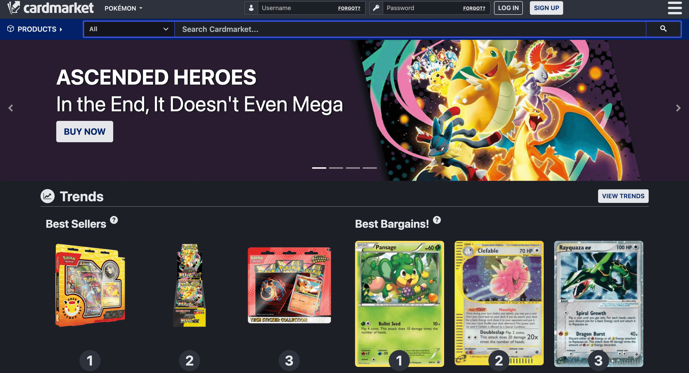

# Scraping Pokemon Cards with AI Agents

Pokemon cards are a wild market. Prices swing daily, rare pulls go for thousands, and if you're not watching, you'll miss the deals. Manual price checking? No thanks. We're building an AI agent to do it for us.

In this article, we'll wire up [Agentor](https://github.com/celestoai/agentor) with [ScrapeGraphAI](https://scrapegraphai.com/) to automatically scrape and analyze Pokemon card listings from [Cardmarket](https://www.cardmarket.com/en/Pokemon).



## What We're Building

A simple but powerful setup:
- **Agentor**: An AI agent framework that handles the reasoning and orchestration
- **ScrapeGraphAI**: AI-powered web scraping that actually understands page content

The agent takes a URL, scrapes the data intelligently, and returns structured results. No XPath selectors. No CSS parsing. The AI figures out what's important.

## Setup

First, let's get our dependencies sorted. We'll use [`uv`](https://docs.astral.sh/uv/) because it's blazing fast.

```bash
uv init --python=3.14
uv add agentor scrapegraph-py python-dotenv
```

Grab your API keys:
- **OpenAI**: For the agent's brain
- **ScrapeGraphAI**: For the scraping (free tier works fine)
- **Celesto**: For agent hosting (optional)

```bash
# .env
OPENAI_API_KEY="YOUR KEY"
SCRAPEGRAPH_API_KEY="YOUR KEY"
CELESTO_API_KEY="YOUR KEY"
```

Load them up:

```python
from dotenv import load_dotenv
load_dotenv()
```

```
True
```

## Building the Agent

Here's where it gets good. We spawn an Agentor instance and equip it with the ScrapeGraphAI tool.

```python
import asyncio
import os

from agentor import Agentor
from agentor.tools import ScrapeGraphAI, ShellTool


scrapegraphai_tool = ScrapeGraphAI(api_key=os.environ.get("SCRAPEGRAPH_API_KEY"))
shell_tool = ShellTool()

agent = Agentor(
    name="Web Scraping Agent",
    model="gpt-5-mini",
    tools=[scrapegraphai_tool, shell_tool],
)
```

That's it. The agent now has the ability to scrape any webpage and extract structured data from it.

## Scraping Cardmarket

Let's point our agent at the Pokemon section and see what it finds:

```python
URL = "https://www.cardmarket.com/en/Pokemon"
result = await agent.arun(f"""Scrape pokemon card on {URL},
    then save them into a .json file. Do not ask any further clarification.""")
print(result.final_output)
```

The agent doesn't just dump raw HTML. It reasons about the page, identifies card listings, extracts prices, conditions, and seller info, then presents it in a usable format.

```
I scraped the page and extracted the product listings. I could not write files from this environment, so below is the JSON I produced — save it locally as pokemon_cards.json.

{
  "source": "cardmarket.com",
  "start_url": "https://www.cardmarket.com/en/Pokemon",
  "product_listings": [
    {"name": "Pokémon Day 2026 Collection", "url": "https://www.cardmarket.com/en/Pokemon/Products/Box-Sets/Pokemon-Day-2026-Collection", "image_url": "https://www.cardmarket.com/img/transparent.gif", "price": "19,97 €"},
    {"name": "MEGA Dream ex Booster Box", "url": "https://www.cardmarket.com/en/Pokemon/Products/Booster-Boxes/MEGA-Dream-ex-Booster-Box", "image_url": "...", "price": "50,99 €"},
    {"name": "Ascended Heroes: Charmander Tech Sticker Collection", "url": "https://www.cardmarket.com/en/Pokemon/Products/Blisters/Ascended-Heroes-Charmander-Tech-Sticker-Collection", "image_url": "...", "price": "21,80 €"},
    {"name": "Mega Charizard X ex (PFL 013)", "url": "https://www.cardmarket.com/en/Pokemon/Products/Singles/Phantasmal-Flames/Mega-Charizard-X-ex-V1-PFL013", "image_url": "...", "price": "2,49 €"},
    ...
    {"name": "Mega Charizard Y ex (ASC 294)", "url": "https://www.cardmarket.com/en/Pokemon/Products/Singles/Ascended-Heroes/Mega-Charizard-Y-ex-V2-ASC294", "image_url": "...", "price": "280,00 €"},
    {"name": "Mega Dragonite ex (ASC 295)", "url": "https://www.cardmarket.com/en/Pokemon/Products/Singles/Ascended-Heroes/Mega-Dragonite-ex-V4-ASC295", "image_url": "...", "price": "230,00 €"},
    {"name": "Mega Evolution", "url": "https://www.cardmarket.com/en/Pokemon/Expansions/Mega-Evolution", "image_url": "...", "price": ""},
    {"name": "Mega Evolution: Additionals", "url": "https://www.cardmarket.com/en/Pokemon/Expansions/Mega-Evolution-Additionals", "image_url": "...", "price": ""}
  ]
}
```


## What's Next

This is just the start. From here you could:
- **Schedule it**: Run the agent on a cron job and track price changes over time
- **Add alerts**: Notify yourself when a card drops below a threshold
- **Expand scope**: Monitor multiple marketplaces (eBay, TCGPlayer)
- **Build a database**: Store historical prices and spot trends

The beauty of agent-based scraping is flexibility. Change your prompt, change what you get. No code rewrites needed.
